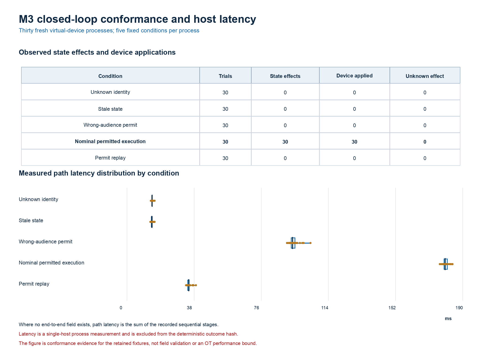

# Aegis-OT

Aegis-OT is a defensive research implementation of an independently enforced runtime-assurance control plane for autonomous agents operating against simulated operational-technology environments.

The system treats an agent proposal as data, not authorization. A consequential action is eligible for execution only after the gateway validates workload identity, the complete delegation chain, policy, state freshness, replay status, modeled safety, and any required approval. The implementation does not connect to production OT and does not establish real-world effectiveness.

## Current evidence boundary

This repository is a reconstructed v0.1 foundation created after the original local project package was lost. Earlier commit hashes, test counts, documents, and preliminary results described in the handoff are historical user-provided information; they are not reproduced evidence in this repository. Only results generated from this repository and linked to a manifest may be reported as current measurements.

## Architecture

```text
telemetry -> bounded agent -> ActionProposal -> AegisGateway
                                           |-> identity/delegation
                                           |-> contextual policy
                                           |-> independent safety kernel
                                           |-> replay protection
                                           `-> evidence chain
                                                    |
                                  signed execution permit
                                                    |
                                      command translator
                                                    |
                              signed Modbus mailbox on loopback
                                                    |
                           spawned virtual-device/plant process
                              |-> permit-aware PyModbus device
                              `-> pandapower CIGRE MV model
                                                    |
                                 signed acknowledgment + readback
```

The gateway is the sole authorization route. The current M3 increment places the
virtual device and physical model in a spawned child process and carries commands
through a signed application mailbox over Modbus TCP bound to host loopback. This
is a real process and protocol boundary in the tested local configuration, but it
is not network segmentation, OpenPLC, a physical PLC, HELICS coordination, or a
multi-VM deployment. Development-mode identity, policy, and evidence components
also remain in process.

## Quick start

```bash
python -m venv .venv
source .venv/bin/activate
python -m pip install --upgrade pip
python -m pip install -e ".[dev,docs,simulation]"
python scripts/export_schemas.py --check
python scripts/build_public_demo.py --check
pytest --cov=aegis_ot --cov-branch --cov-report=term-missing --cov-fail-under=90
ruff check .
python -m aegis_ot demo --output-dir results/demo
python -m aegis_ot experiment --trials-per-seed 36 --seed-count 30 \
  --seed 20260824 --output-dir results/m2-independent-oracle
```

Windows PowerShell activation is `.venv\Scripts\Activate.ps1`.

### PyCharm local setup

Create the environment from the repository root, then select
`.venv/bin/python` as the project interpreter in PyCharm. On Windows, select
`.venv\Scripts\python.exe`. Set the run configuration working directory to the
repository root so configuration, schemas, policy, and result paths resolve
consistently.

A PyCharm terminal can run a one-session M3 smoke check with the installed
console entry point:

```bash
.venv/bin/aegis-ot physical-experiment \
  --seed-count 1 \
  --seed 20260824 \
  --output-dir /private/tmp/aegis-m3-smoke
```

The equivalent PyCharm Python run configuration uses the script path
`.venv/bin/aegis-ot`, parameters `physical-experiment --seed-count 1 --seed
20260824 --output-dir /private/tmp/aegis-m3-smoke`, and the repository root as
its working directory. Use `.venv\Scripts\aegis-ot.exe` and a suitable temporary
directory on Windows. When the environment is activated, the same entry point
can be invoked as `aegis-ot physical-experiment`.

The current local implementation has 289 passing tests and 91.35 percent
branch-aware coverage. Ruff, strict mypy, schema-drift, bounded formal-model,
and Compose-configuration checks are also clean locally. These are local
implementation-verification results; they are not an observed remote CI run,
independent replication, physical validation, or operational validation. The
retained controlled M3 experiment described below is a separate evidence set.

Run the same local verification path with:

```bash
.venv/bin/python scripts/export_schemas.py --check
.venv/bin/python scripts/build_public_demo.py --check
.venv/bin/ruff check .
.venv/bin/mypy src scripts/build_public_demo.py
.venv/bin/python -m pytest \
  --cov=aegis_ot --cov-branch --cov-report=term-missing --cov-fail-under=90
docker compose config --quiet
AEGIS_TLA_JAR=/absolute/path/to/tla2tools-1.8.0.jar
.venv/bin/python scripts/run_formal.py \
  --jar "$AEGIS_TLA_JAR" \
  --output-dir /private/tmp/aegis-formal-check
```

Compose configuration validation proves that the file resolves; it does not
prove that the services started, that the M3 process ran in containers, or that
network trust boundaries were enforced.

## Containers

The default OPA and Python base images are pinned to verified multi-platform digests, so PyCharm can run Compose without defining environment variables:

```bash
docker compose up --build -d
docker compose ps
curl http://127.0.0.1:8080/health
curl http://127.0.0.1:8181/health
```

Copy `.env.example` to `.env` only when deliberately overriding an image. Overrides must remain version-and-digest pinned.

## Public demonstration

After Compose starts the public demo service, open
`http://127.0.0.1:8080/demo` in a browser. The repository root redirects to the
same page. The demonstration is a self-contained, read-only explorer of the
retained M2 and M3 evidence: it shows the seven-stage transaction path, all five
registered M3 conditions, exact trial denominators and Wilson intervals, the M2
baseline comparison, and hashes binding the displayed summary to its source
artifacts.

The Compose-published application exposes only the read-only demonstration,
health, and packaged-evidence routes. It does not publish `/v1/decisions` or
`/v1/state`; requests to those paths have no public route. The page fetches only
packaged local assets and the read-only `/health` and `/v1/demo/evidence`
endpoints. It does not open a device socket, rerun an experiment, or issue a
control command. A running page therefore demonstrates the presentation and API
path, not physical validity, independent replication, production readiness, or
operational effectiveness.

The mutable research API is a separate local interface. Start it only for
deliberate local experimentation, bind it to loopback, and never expose it as a
public service:

```bash
.venv/bin/uvicorn aegis_ot.api:control_app --host 127.0.0.1 --port 8081
```

When started with that command, the loopback-bound application provides
`/v1/decisions` and `/v1/state`; it is not the application launched by the
default Compose configuration.

If a retained source manifest or summary changes, rebuild and verify the
packaged display data before committing it:

```bash
.venv/bin/python scripts/build_public_demo.py
.venv/bin/python scripts/build_public_demo.py --check
```

## Trust-boundary schemas

`ActionProposal` and the M3 physical-state, command, candidate, permit,
acknowledgment, closed-loop-result, and Modbus mailbox models are the
authoritative validation contracts. Regenerate and verify their public JSON
Schemas with:

```bash
python scripts/export_schemas.py
python scripts/export_schemas.py --check
```

Operation-specific parameters are closed sets. Unknown keys, nonnumeric values, non-finite values, out-of-range percentages, extra message fields, and timezone-naive timestamps are rejected before authorization evaluation.

## M3 physical and virtual-device experiment

The current M3 implementation uses the packaged pandapower 3.5.4 CIGRE MV
network with an Aegis-OT synthetic mission-priority load subset. It performs a
balanced steady-state AC Newton-Raphson power flow. A signed, short-lived,
single-use execution permit binds the exact proposal, command, candidate
assessment, model, topology, pre-state, expected post-state, policy, safety
version, evidence record, and device audience. The child process validates the
permit, independently repeats the candidate calculation, applies an accepted
command transactionally, and returns a signed acknowledgment. The parent
accepts completion only after acknowledgment verification and state readback.

The controlled experiment starts one fresh child process per master seed and
runs five fixed conformance conditions: unknown identity, stale state, a permit
whose audience field is altered after signing, nominal permitted execution, and
permit replay. The seeds vary session identifiers and process instances, not
the deterministic power-flow physics.

The primary controlled run executed on 2026-08-24 from clean commit
`168b8bd61a13f70e0871d36e56acbe76a8ebb659`. It retained 30 sessions, 150
trial records, and 270 chained evidence events in
`results/m3-physical-modbus`. A second run retained in
`results/m3-physical-modbus-reproduction` records the same commit and lock-file
hash, host metadata, Python version, and selected component versions. Both
packages pass the offline verifier from the matching clean checkout and have the
same timing-independent deterministic outcome hash:

```text
150b32da0055da6086a8f858f8dab4425d06b5bfd836ba653a10c1f20adf9005
```

The primary-package observations were balanced at 30 per condition. Unknown
identity and stale state were denied before dispatch; all 30 altered-audience
permit artifacts returned `permit_wrong_audience` from the virtual device; all
30 nominal commands were applied, acknowledged, and read back; and all 30 replay
attempts were rejected without a second modeled effect. Across the 120
non-nominal trials, 0 modeled effects and
0 unauthorized device applications were observed under the registered
end-to-end metric (two-sided 95 percent Wilson upper bound, 3.102 percent). That
denominator includes 60 gateway-denied trials that never reached the device; it
is not a device-dispatch-conditional acceptance rate. Nominal closed-loop
completion was 30/30 (Wilson lower bound, 88.649 percent). Unknown effects were
0/150, but the runner fails the controlled run if any unknown effect occurs, so
this is a conformance-completeness check rather than an ambiguity-rate estimate.
The registered narrow trace indicator--proposal, decision, and nonempty terminal
evidence hash--was complete for 150/150 trials (Wilson lower bound, 97.503
percent); the stronger package checks are reported separately by the offline
verifier. Exactly 90 primary-package trials contain signed device
acknowledgments; the 60 gateway no-dispatch trials use the registered
verified/not-applicable convention because no device acknowledgment should
exist.

For the deterministic nominal fixture, the post-action minimum voltage was
0.9528655132 per unit, maximum line loading was 54.60778755 percent, and the
synthetic priority-load subset remained 100 percent served with no registered
voltage, thermal, or supervisory unsafe-state flags. These identical physical
values across sessions reflect repeated execution of one fixed model and
operating point, not a distribution of grid conditions. The controlled nominal
host-latency mean was 180.551 ms; host latency is excluded from the outcome
hash and is not an OT performance bound.



Verify the retained packages without opening a device socket from a clean
checkout whose source, schema, project, and lock hashes match the manifest. A
modified checkout will intentionally fail `checkout_bindings`:

```bash
.venv/bin/aegis-ot verify-physical-evidence \
  --output-dir results/m3-physical-modbus
.venv/bin/aegis-ot verify-physical-evidence \
  --output-dir results/m3-physical-modbus-reproduction
```

Each retained package includes the manifest, raw trial and evidence JSONL,
scenario and summary files, per-session component health, evidence verification,
benchmark provenance, solver configuration, artifact hashes, and a
timing-independent deterministic outcome hash. The verifier establishes
package/current-checkout internal consistency only: the manifest is unsigned,
and the verification keys are retained in `component-health.json` inside the
unsigned package. The second run is a local reproduction under matching recorded
conditions, not independent replication.

M3 remains bounded to localhost, a PyModbus virtual device, and steady-state
simulation. It does not model electromagnetic transients, subcycle protection,
relay timing, hardware I/O, field dynamics, or production OT. HELICS, OpenPLC,
SPIFFE/SPIRE, service-backed OPA enforcement, multi-VM isolation, field data,
hardware-in-the-loop testing, and external validation have not been completed.

## Bounded formal model

The TLA+ model covers submission, authorization or denial, dispatch,
acknowledgment, execution, full-chain delegation, ancestor revocation, grant
expiry, replay, policy and state consistency, approval, conflicting actions,
evidence, compromise, and quarantine. Run the intended model and all targeted
weakened variants with the pinned TLC JAR:

```bash
python scripts/run_formal.py \
  --jar /path/to/tla2tools.jar \
  --output-dir results/formal/<run-name>
```

The runner verifies the expected result for every case and records tool, model,
configuration, state-space, runtime, Git, host, and counterexample evidence.
See `docs/formal/conformance.md` for the explicit runtime mapping and gaps.
The committed M1 run is under `results/formal/m1-authorization-conformance`.

## Synthetic experiment

The M2 experiment uses 12 reviewed synthetic scenarios, eight control-path
baselines and ablations, 30 deterministic master seeds, Wilson 95 percent
intervals, and a separately implemented reference transition model. The
reference model uses conservative guardbands so kernel-oracle disagreements are
visible rather than forced to zero. It is independent at the code-path level;
it is not a power-flow simulator or evidence of field effectiveness. See
`docs/experiments/m2-method.md` for baseline and metric definitions.

## Safety and disclosure

Use only public, synthetic, or specifically authorized data and simulated assets. See `SECURITY.md`. Report vulnerabilities privately through the repository security advisory process when available.

## Authorship

Project owner, principal investigator, and author: Angelis Pseftis.
