# Aegis-OT systems-engineering views

This is the maintained visual guide to the current Aegis-OT research system. The views answer different engineering questions without treating proposed work, implemented controls, retained evidence, and operational validation as the same state.

Start with the overview and context views. Use the behavioral views to trace a proposal and its possible outcomes, then use the deployment, trust, evidence, and verification views for setup or review.

## View index

| View | Engineering question | Primary implementation sources |
|---|---|---|
| [System overview](../../assets/diagrams/00-system-overview.svg) | What are the major components, authority boundaries, and evidence path? | `docker-compose*.yml`, `segmented_capability_runtime.py`, `api.py` |
| [System context](../../assets/diagrams/01-system-context.svg) | Who interacts with the system, and what remains outside its boundary? | `models.py`, `gateway.py`, `capability_control.py` |
| [Functional decomposition](../../assets/diagrams/02-functional-decomposition.svg) | Which functions authorize, observe, simulate, execute, and classify? | `gateway.py`, `delegation.py`, `policy.py`, `safety.py` |
| [Deployment and networks](../../assets/diagrams/03-deployment-network.svg) | Which services share each Compose network, and what is host-published? | `docker-compose.yml`, `docker-compose.capability.yml` |
| [Assurance overlay stack](../../assets/diagrams/04-assurance-overlay-stack.svg) | Which overlays depend on earlier layers, and what evidence exists for each? | `docker-compose*.yml`, `results/` |
| [Authorized action sequence](../../assets/diagrams/05-action-transaction-sequence.svg) | What happens from challenged observation through terminal disposition? | `capability_control.py`, `capability_plc.py`, `segmented_capability_runtime.py` |
| [Outcome and effect states](../../assets/diagrams/06-outcome-state-model.svg) | How are terminal capability outcomes classified, and what are the M4i states? | `capability_models.py`, `coordination_models.py` |
| [Identity and transport trust](../../assets/diagrams/07-identity-trust-lifecycle.svg) | How do application credentials and SPIRE mTLS differ? | `m4g_identity*.py`, `spire_*.py`, identity and SPIRE overlays |
| [Replay and effect coordination](../../assets/diagrams/08-replay-effect-coordination.svg) | Which duplicate or uncertainty hazard does each control address? | `segmented_capability_transport.py`, replay and coordination journals |
| [Evidence and reproducibility](../../assets/diagrams/09-evidence-reproducibility.svg) | How are experiment artifacts bound, verified, retained, and projected? | experiment runners, package verifiers, `build_public_demo.py` |
| [Public-demo data path](../../assets/diagrams/10-public-demo-data-path.svg) | What is validated at build time, and what can the runtime serve? | `build_public_demo.py`, `api.py`, `web_demo/` |
| [Developer setup](../../assets/diagrams/11-developer-setup-verification.svg) | What is the safe path from checkout to a retained local result? | `pyproject.toml`, experiment runners, README |
| [Verification gates](../../assets/diagrams/12-verification-gates.svg) | Which checks support implementation, experiment, CI, and readiness claims? | `.github/workflows/ci.yml`, `scripts/run_formal.py`, tests |

## Status language

- **Implemented** means code or configuration exists in the current repository. It does not imply that a retained experiment passed.
- **Retained evidence** means an artifact is present under `results/` and is bounded by its recorded method, source state, and acceptance criteria.
- **Optional** means the control is enabled only through an explicit overlay or runner.
- **Active development** means the repository contains building blocks or focused tests, but the path is not a supported end-to-end capability.
- **Outside scope** identifies an actor, environment, or claim that the current single-host synthetic configuration does not establish.

The M4i effect-coordination contracts, two journals, transport class, runtime endpoints, initializer, and focused tests are present. The current gateway builder still uses the non-coordinated virtual-PLC port, and the coordination overlay requires a path that the normal action runtime does not invoke. M4i therefore remains dashed in these views. There is no retained M4i campaign, consensus result, hostile rollback resistance, or exactly-once-effect claim.

The optional SPIRE overlay issues X.509-SVIDs for the gateway, observer, candidate, OT adapter, and plant, protecting their internal capability links with mTLS. Agent-to-gateway, host-to-gateway, and gateway-to-OPA remain HTTP. Application workload credentials separately authenticate the agent, gateway, and OT adapter. Deleting a SPIRE registration prevents fresh issuance; it is not immediate revocation of an already-issued certificate.

## Maintained views

### 00 — System overview

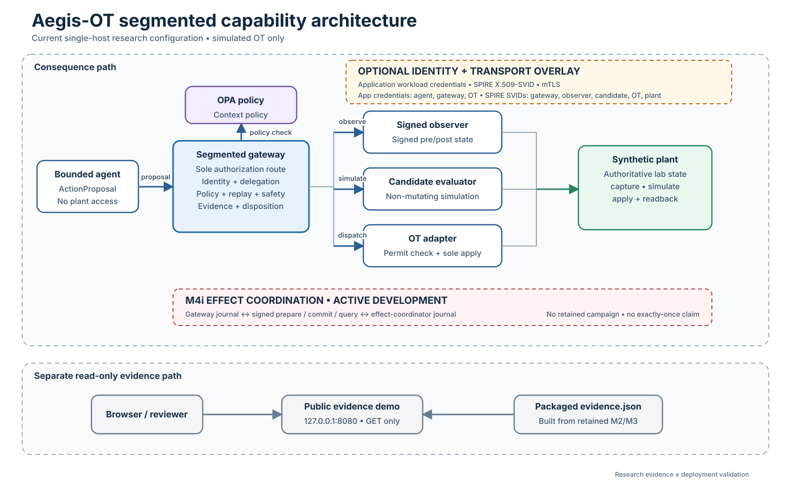

### 01 — System context

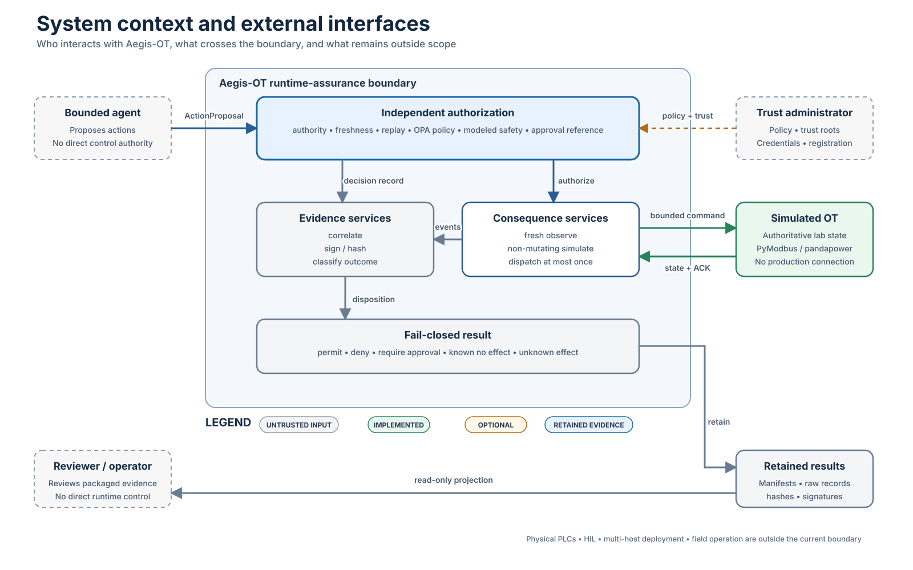

### 02 — Functional decomposition

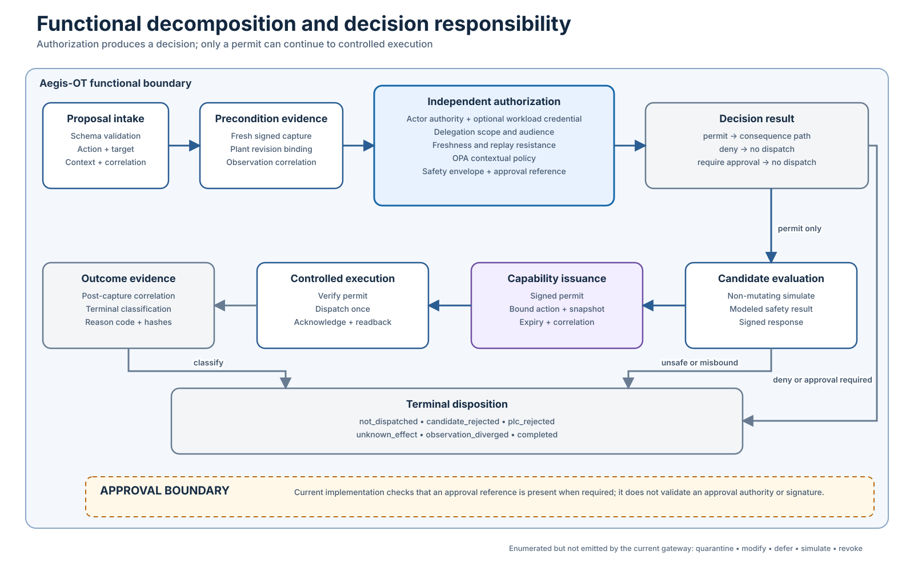

### 03 — Deployment and network segmentation

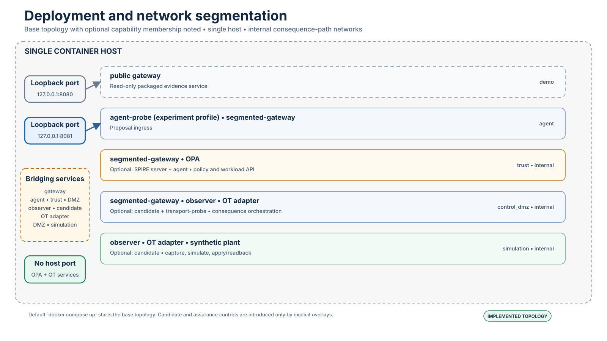

### 04 — Assurance overlay stack

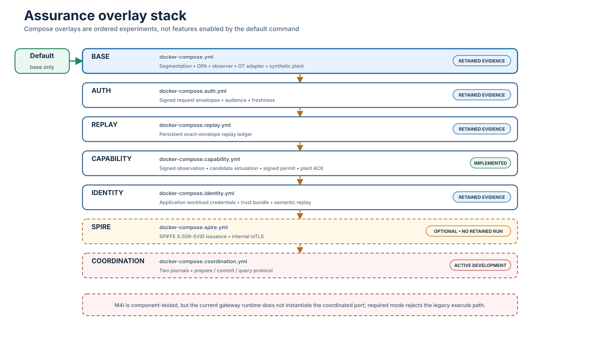

### 05 — Authorized action transaction

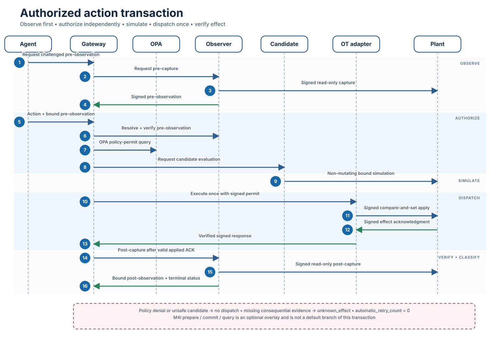

### 06 — Outcome and effect states

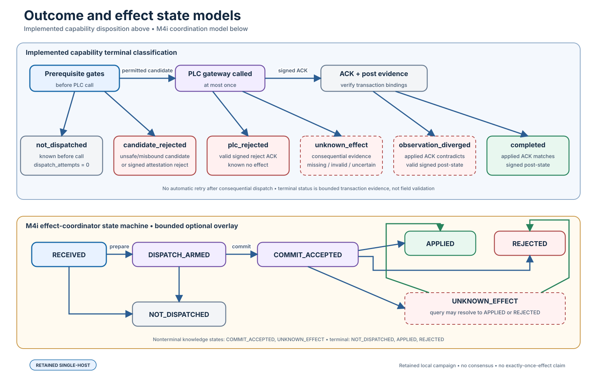

### 07 — Identity and transport trust

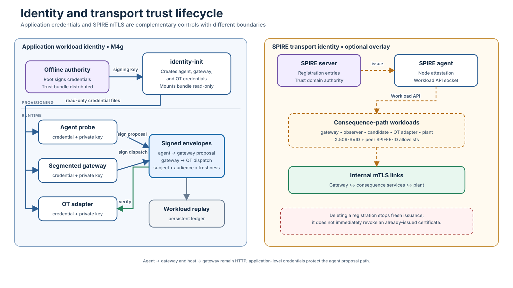

### 08 — Replay resistance and effect coordination

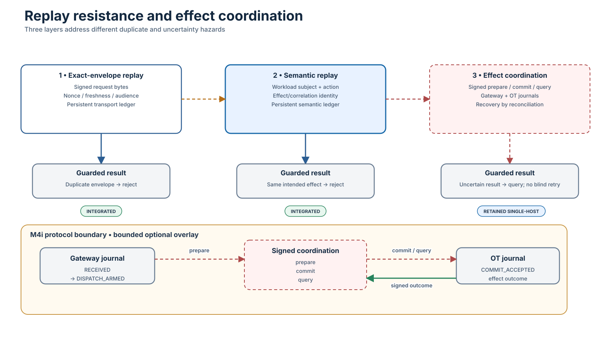

### 09 — Evidence and reproducibility

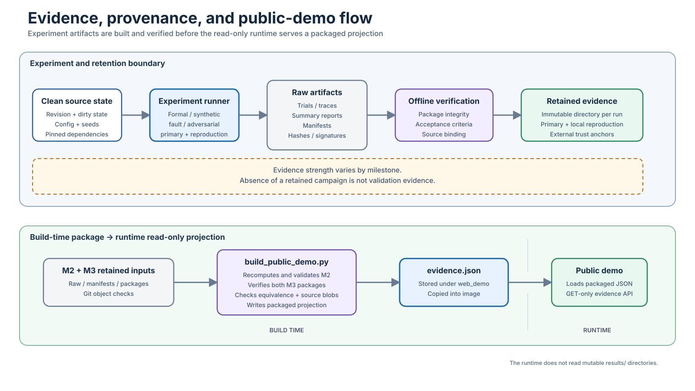

### 10 — Public-demo data path

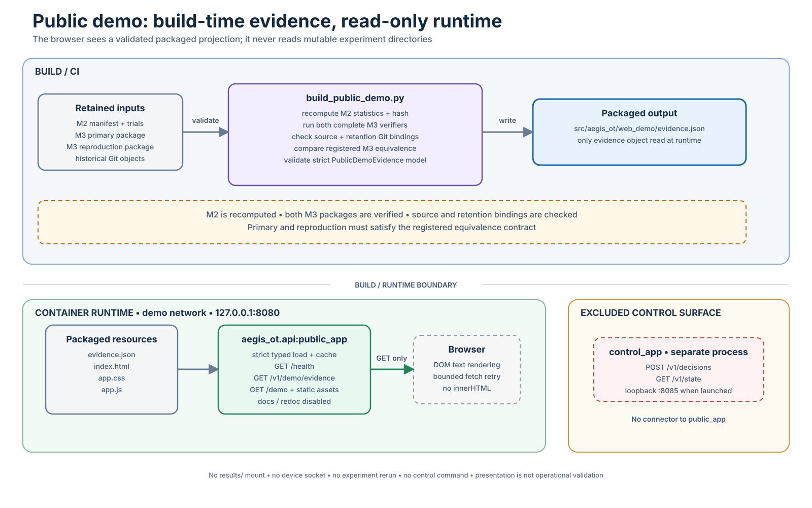

### 11 — Developer setup and local verification

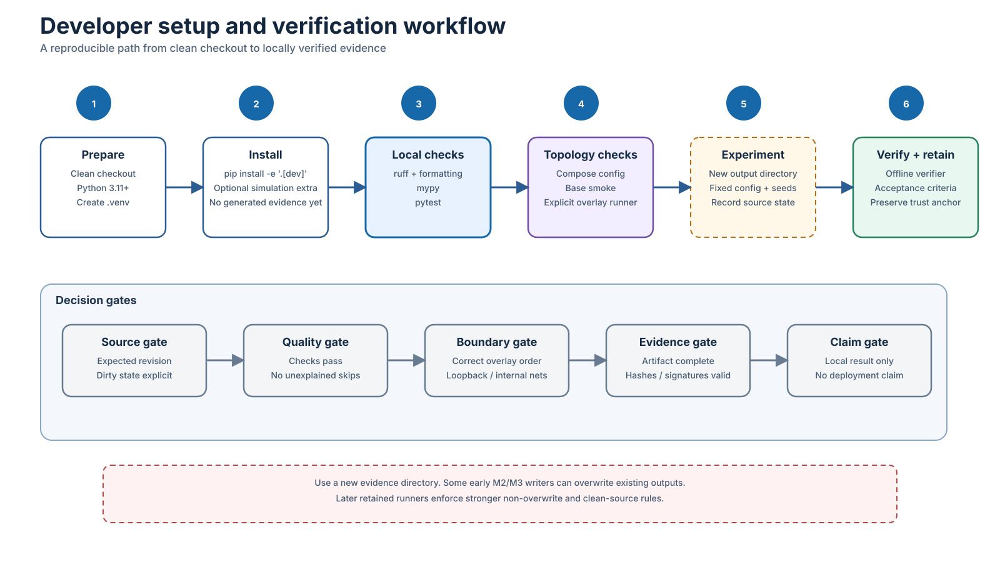

### 12 — Verification gates

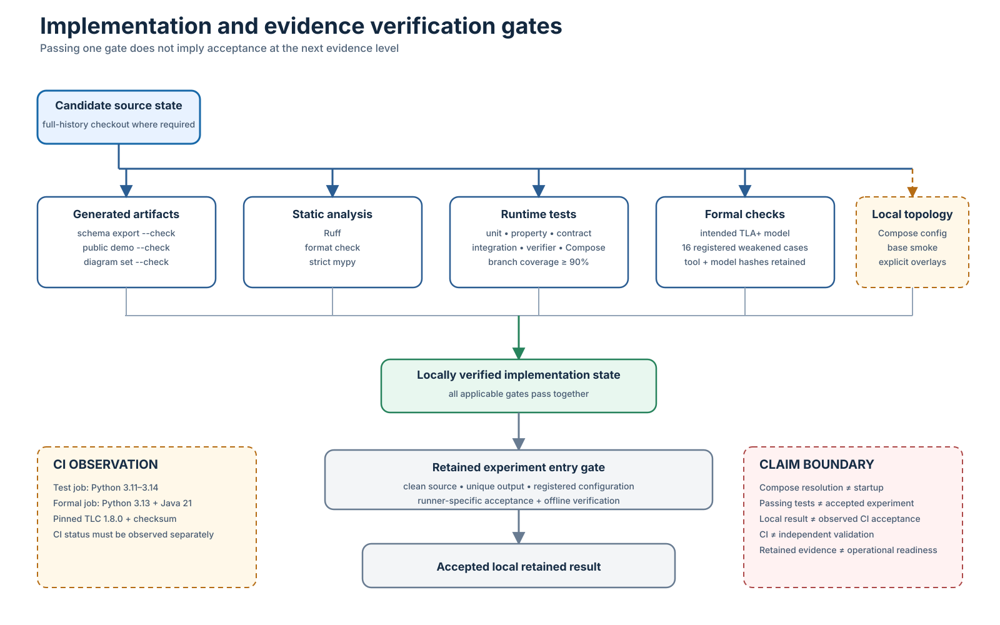

## Maintenance contract

The authoritative diagram source is `scripts/build_system_diagrams.py`. Do not edit generated SVGs directly.

Regenerate and verify the set with:

```bash
.venv/bin/python scripts/build_system_diagrams.py
.venv/bin/python scripts/build_system_diagrams.py --check
```

`tests/test_system_diagrams.py` verifies that every expected view exists, matches the builder, parses as SVG, and includes accessible title and description metadata. Because the drift check runs within the test suite, an architecture change that leaves the committed views stale fails local and CI verification.

When changing a component, interface, trust boundary, Compose overlay, terminal state, evidence path, or verification gate, update the builder and this index in the same change. Update the implementation first; a diagram is explanatory evidence, not the source of runtime behavior.

Author: Angelis Pseftis
